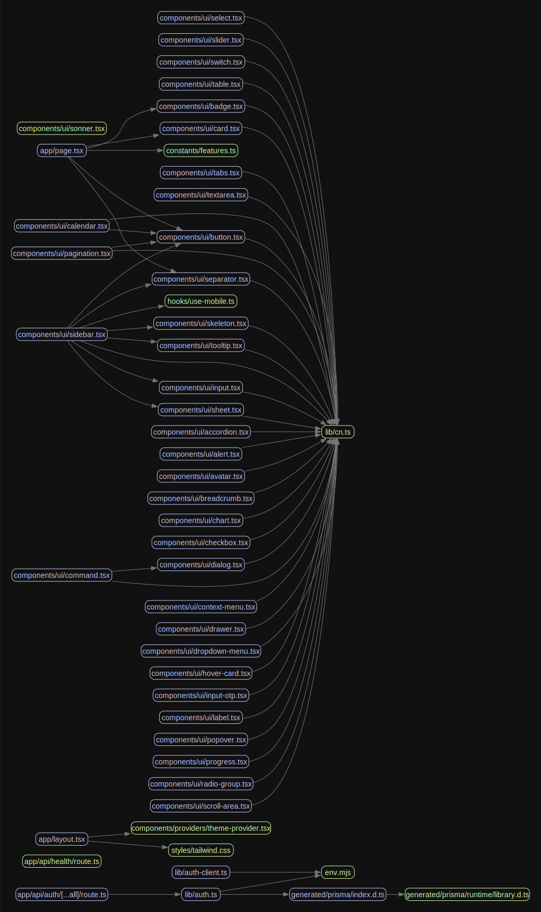

# Next.js Boilerplate

<div align="center">
  
  
  
</div>

<p align="center">
  <strong>Modern, production-ready template for Next.js applications</strong>
</p>

<p align="center">
  
</p>

Welcome to the **Next.js Enterprise Boilerplate**, a comprehensive starter template designed for building scalable, maintainable, and high-performance applications. This boilerplate comes packed with all the tools and configurations you need to jumpstart your next big project.

## ✨ Features

### Core Technologies

- 🚀 [**Next.js 15**](https://nextjs.org/) - The React framework with App Router
- 💅 [**Tailwind CSS 4**](https://tailwindcss.com/) - Utility-first CSS framework
- 🧰 [**TypeScript**](https://www.typescriptlang.org/) - With strict type safety via `ts-reset`
- 🔍 [**ESLint 9**](https://eslint.org/) & [**Prettier 3**](https://prettier.io/) - Code quality tools

### UI Components

- 🧩 [**Radix UI**](https://www.radix-ui.com/) - Headless UI components
- 🎨 [**CVA**](https://cva.style/) - Type-safe variant components

### Database & Authentication

- 📊 [**Prisma 6**](https://www.prisma.io/) - Next-generation ORM
- 🔐 [**Better Auth**](https://github.com/better-auth/better-auth) - Authentication solution

### Development Experience

- 📦 [**Bun**](https://bun.sh/) - JavaScript runtime & package manager
- 🔄 [**Semantic Release**](https://github.com/semantic-release/semantic-release) - Automated version management
- 🧹 [**Conventional Commits**](https://www.conventionalcommits.org/) - Commit message standard
- 📊 [**Bundle Analyzer**](https://www.npmjs.com/package/@next/bundle-analyzer) - Bundle size visualization

### CI/CD & DevOps

- 🔄 [**GitHub Actions**](https://github.com/features/actions) - CI/CD workflows
- 🤖 [**Renovate Bot**](https://www.whitesourcesoftware.com/free-developer-tools/renovate) - Automated dependency updates
- 🔭 [**OpenTelemetry**](https://opentelemetry.io/) - Observability framework

### Environment Management

- �� [**T3 Env**](https://env.t3.gg/) - Type-safe environment variables

## 🚀 Getting Started

### Prerequisites

- Node.js 20.x or higher
- Bun 1.x or higher

### Installation

1. Clone the repository:

```bash
# Don't forget to ⭐ star the repo first!
git clone https://github.com/yourusername/next-enterprise.git
cd next-enterprise
```

2. Install dependencies:

```bash
bun install
```

3. Set up environment variables:

```bash
cp .env.example .env
```

4. Start the development server:

```bash
bun dev
```

5. Open [http://localhost:5995](http://localhost:5995) with your browser to see the result.

### Setting up Git Hooks

This project uses a git hook to enforce conventional commits:

```bash
brew install pre-commit
pre-commit install -t commit-msg
```

## 🛠️ Scripts

| Command               | Description                          |
| --------------------- | ------------------------------------ |
| `bun dev`             | Start development server             |
| `bun run build`       | Build the application for production |
| `bun start`           | Start the production server          |
| `bun lint`            | Run ESLint                           |
| `bun prettier:fix`    | Fix formatting issues                |
| `bun analyze`         | Analyze bundle sizes                 |
| `bun coupling-graph`  | Generate component coupling graph    |
| `bun prisma:generate` | Generate Prisma client               |
| `bun prisma:studio`   | Open Prisma Studio                   |
| `bun auth:generate`   | Generate better-auth schema          |

## 📊 Component Coupling Graph

The `coupling-graph` script generates a visual representation of your component dependencies:

```bash
bun coupling-graph
```

This creates a `graph.svg` file showing the connections between your components.

## 🌐 Environment Variables

This project uses T3 Env for type-safe environment variable management. Configure your variables in `env.mjs`:

```typescript
export const env = createEnv({
  server: {
    // Server variables
    DATABASE_URL: z.string().url(),
  },
  client: {
    // Client variables
    NEXT_PUBLIC_API_URL: z.string().url(),
  },
  // ...
})
```

## 🚢 Deployment

Deploy your Next.js app easily with [Vercel](https://vercel.com/):

[](https://vercel.com/new/git/external?repository-url=https://github.com/Blazity/next-enterprise)

## 🤝 Contributing

Contributions are welcome! Please follow these steps:

1. Fork the repository
2. Create a feature branch (`git checkout -b feature/amazing-feature`)
3. Commit your changes using [Conventional Commits](https://www.conventionalcommits.org/)
4. Push to the branch (`git push origin feature/amazing-feature`)
5. Open a Pull Request

## 📄 License

This project is licensed under the MIT License - see the [LICENSE](./LICENSE) file for details.
